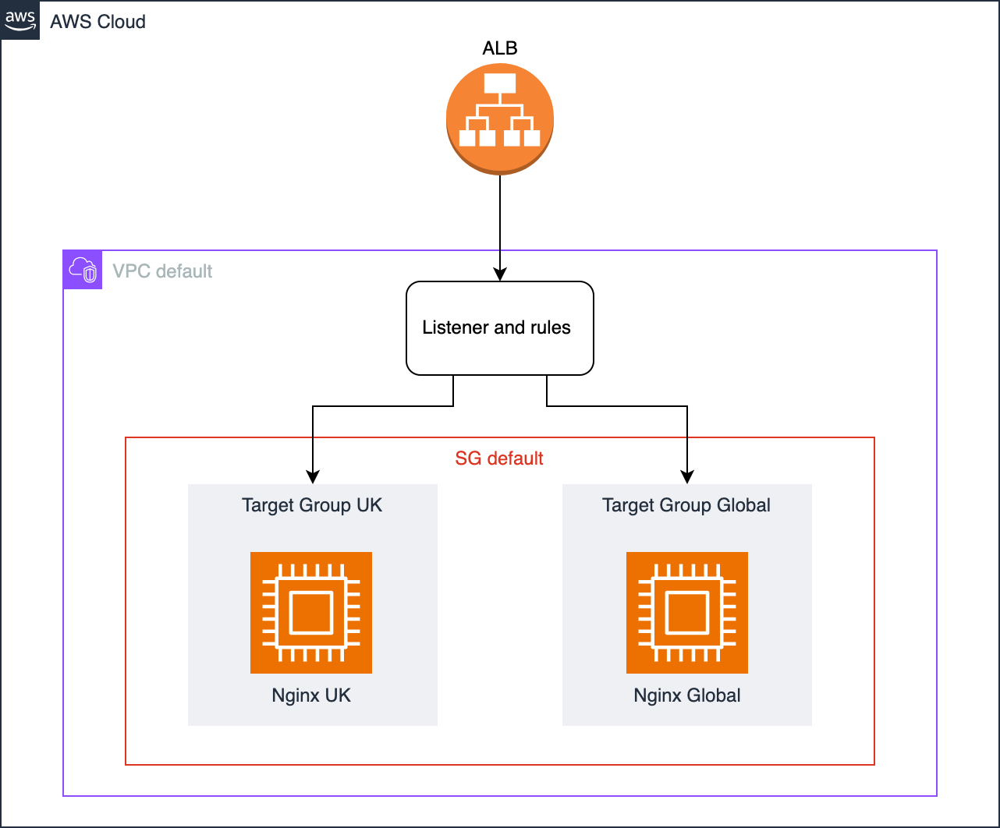
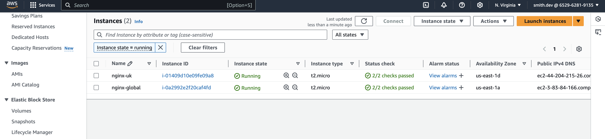
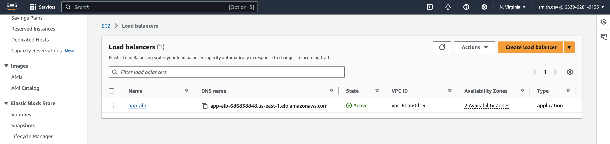
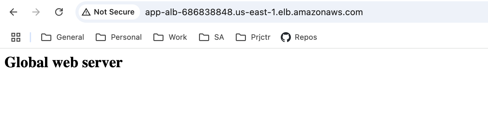
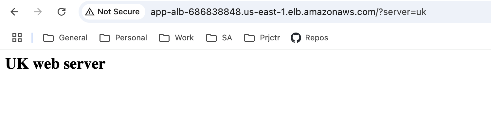

# HSA AWS Load Balancer setup

Resources

1. [Official terraform examples](https://github.com/hashicorp/terraform-provider-aws/tree/main/examples)

Nginx commands:
```
sudo apt install nginx -y
sudo systemctl start nginx
sudo systemctl enable nginx
sudo systemctl status nginx
```

Connect to ec2 via ssh (specify key-pair `devops` in ec2 config first):
```
chmod 400 devops.pem
ssh -i "devops.pem" ec2-user@ec2-54-89-221-211.compute-1.amazonaws.com
```

<h3>Task</h3>
- Create 2 micro instances in AWS
- Setup application load balancer and assign instances to it

<h3>Description</h3>

Infrastructure diagram



Infrastructure setup plan:
1. Configure the EC2 instances
2. Create an ALB Target Group
3. Add the ALB Target Group attachment
4. Create an ALB Listener
5. Manage custom ALB Listener rules
6. Test the path-based routing on ALB

Prerequisites
1. Configure aws access via [AWS CLI](https://aws.amazon.com/cli/)
2. Setup [Terraform CLI](https://developer.hashicorp.com/terraform/cli)
3. Create Key-Pair ``devops`` to connect ec2 via ssh

Set variables in terraform/infra.tfvars and apply changes:
```
cd terraform
terraform init
terraform apply -var-file="infra.tfvars"
terraform destroy -var-file="infra.tfvars"
```

EC2 instances:



ALB instance:



ALB routing:


